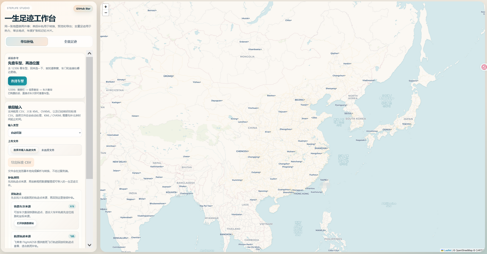

# 一生足迹工作台

StepLife Studio 是一个给「一生足迹」做补轨、预览、导出和回看的本地优先工具集。

<p>
  
  
  
  
</p>



## 现在能做什么

- `单段补轨`
  把航班 CSV、铁路 KML、OVKML 或标准 CSV 转成可预览、可导出的一生足迹标准 CSV。
- `全量足迹`
  把整包足迹做成人生热力图、常去地点、年度扩张和记忆卡片。
- `乘前打点参考`
  先去 12306 查车型，回来选择车型，就能快速看不靠窗、靠窗、贴车门、连接处四个位置的开图参考。
- `补轨资料`
  首页直接提供铁路车次来源、航班轨迹来源、铁路补轨教程和奥维导出教程入口。

整体思路是本地优先：
- 文件尽量在浏览器或本地脚本里处理
- 不依赖后端服务完成转换
- 静态页面可直接部署到 GitHub Pages / Vercel

## 典型使用链路

### 乘后补轨

1. 打开 `单段补轨`
2. 上传 `Flight CSV / Train KML / OVKML / 标准 CSV`
3. 需要时补充 KML / OVKML 的北京时间起止时间
4. 在地图上预览轨迹、回放、检查统计
5. 导出一生足迹可导入的标准 CSV

### 乘前打点

1. 去 12306 搜车次并查看车型
2. 回到首页点击 `选择车型`
3. 查看昵称，以及不靠窗、靠窗、贴车门、连接处四个位置的信号参考
4. 需要时展开 `全部车型对照表` 做横向比较

## 功能概览

### 单段补轨

- 支持 `Flight CSV / Train KML / OVKML / 标准 CSV`
- 支持自动识别输入类型
- `KML / OVKML` 可补填北京时间起止时间
- 地图预览、起终点标记、轨迹回放、基础统计
- 导出为一生足迹可用的标准 CSV

### 全量足迹

- 人生热力图
- 常去地点
- 年度扩张
- 记忆卡片墙

### 乘前打点参考

- 车型选择后直接展示结果卡
- 查看昵称和四个位置的开图参考
- 支持展开完整车型对照表
- 更偏向足迹迷的乘前参考，不替代官方信息

### 补轨资料

- 铁路车次来源
- 航班轨迹来源
- 铁路补轨教程
- 奥维导出教程

## 项目结构

```text
steplife/
├─ .github/
├─ data/
├─ docs/
├─ output/
├─ parsers/
│  ├─ flight.py
│  ├─ kml.py
│  └─ ovkml.py
├─ templates/
│  └─ track_viewer_template.html
├─ converter.py
├─ index.html
├─ map_preview.py
├─ readme.md
├─ utils.py
└─ web_viewer.py
```

## 快速开始

运行终端工具：

```bash
python converter.py
```

只生成网页查看器：

```bash
python -c "from web_viewer import generate_web_viewer; print(generate_web_viewer())"
```

默认输出位置：

- 转换结果：`output/`
- 网页查看器：`output/track_viewer.html`

## 静态部署

静态部署入口：

- 首页：`index.html`

可直接用于：

- GitHub Pages
- Vercel
- 其他静态文件托管

## 本地目录说明

这些目录主要用于本地开发和测试：

- `data/`：样例和备份数据
- `output/`：生成结果
- `tmp/`：临时文件和实验产物
- `tools/`：打包后的工具或附属文件

## 说明

- 当前网页地图默认使用 `Leaflet + CARTO Voyager`
- 全量模式更偏向地点、年份和记忆展示，不做交通方式自动识别
- 乘前参考是经验性工具，不替代官方车次和车型信息
- `data/`、`output/`、`tmp/`、`tools/` 默认写入 `.gitignore`
