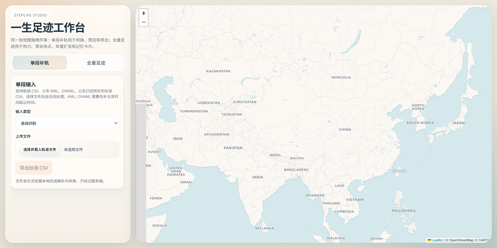

# 一生足迹工作台

StepLife Studio 是一个给“一生足迹”补轨、预览和回看的小工具集。

<p>
  
  
  
  
  
</p>



它现在主要做两件事：

- `单段补轨`：把航班 CSV、火车 KML、OVKML 或标准 CSV 转成可预览、可导出的轨迹
- `全量足迹`：把整包足迹做成热力图、常去地点、年度扩张和记忆卡片

整体是本地优先的思路：文件尽量在浏览器或本地脚本里处理，不额外依赖复杂后端。

## 功能概览

### 单段补轨

- 支持 `Flight CSV / Train KML / OVKML / 标准 CSV`
- `KML / OVKML` 可补填北京时间起止时间
- 地图预览、起终点标记、轨迹回放、基础统计
- 导出为一生足迹可用的标准 CSV

### 全量足迹

- 人生热力图
- 常去地点
- 年度扩张
- 记忆卡片

## 项目结构

```text
steplife/
├─ converter.py
├─ docs/
├─ map_preview.py
├─ utils.py
├─ web_viewer.py
├─ parsers/
└─ templates/
```

## 本地运行约定

这些目录用于你本地开发和测试，默认不会进入 GitHub：

- `data/`：本地样例和备份数据
- `output/`：生成结果
- `tmp/`：临时文件和旧实验资产
- `tools/`：打包后的 exe

## 快速开始

运行终端工具：

```bash
python converter.py
```

只生成网页查看器：

```bash
python -c "from web_viewer import generate_web_viewer; print(generate_web_viewer())"
```

默认输出位置：

- 转换结果：`output/`
- 网页查看器：`output/track_viewer.html`

## 说明

- 当前网页查看器统一使用 `Voyager` 瓦片风格
- 全量模式更偏向“地点、年份、记忆”的展示，不做交通方式自动识别
- `data/`、`output/`、`tmp/`、`tools/` 默认写入 `.gitignore`
